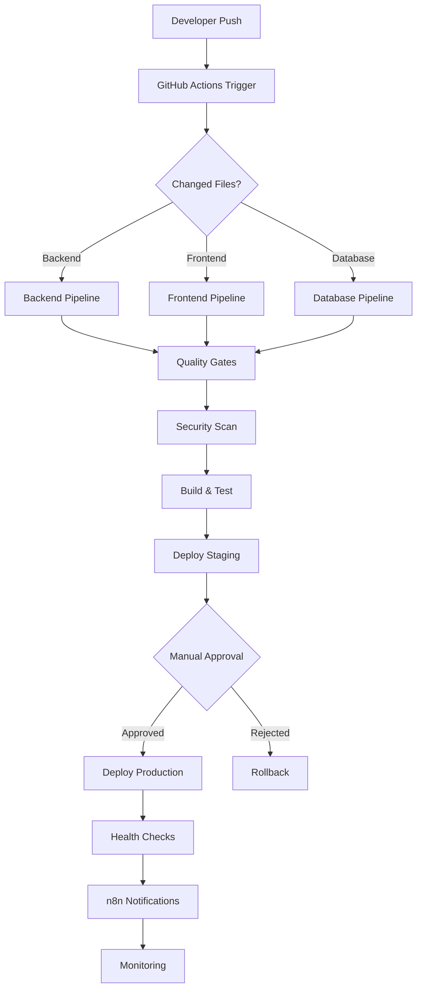

# CI/CD Pipeline Documentation

This directory contains comprehensive documentation for the Case Management System CI/CD pipeline, designed to support the multi-agent development approach with automated quality gates and peer review workflows.

## 📋 Table of Contents

- [Quick Start Guide](./quick-start.md) - Get up and running with the CI/CD pipeline
- [Pipeline Architecture](./pipeline-architecture.md) - Complete pipeline design and flow
- [Deployment Guide](./deployment-guide.md) - Step-by-step deployment procedures
- [Troubleshooting Guide](./troubleshooting.md) - Common issues and solutions
- [Secrets Management](./secrets-management.md) - Configuration and security
- [Monitoring & Observability](./monitoring.md) - Health checks and metrics
- [Runbooks](./runbooks/) - Operational procedures and emergency response

## 🚀 CI/CD Overview

The Case Management System uses a comprehensive CI/CD pipeline built on GitHub Actions that enforces the three core team principles:

### 1. **Peer Review Model (同儕審查模式)**
- Automated review assignment via CODEOWNERS
- Comprehensive PR templates with quality checklists
- Branch protection rules requiring peer approval
- Automated quality gates and testing

### 2. **Data-Driven Decisions (數據驅動決策)**
- Performance metrics collection and analysis
- Code coverage tracking with 90%+ requirement
- Security vulnerability scanning and reporting
- Lighthouse audits for frontend performance

### 3. **Definition of Done (完整流程的「完成」定義)**
- 8-step validation cycle for all changes
- Automated testing (unit, integration, E2E)
- Security scanning and compliance checks
- Successful staging deployment before production

## 🏗️ Pipeline Architecture

## 🔧 Core Components

### GitHub Actions Workflows
- **Backend CI/CD**: `/backend/**` changes trigger NestJS pipeline
- **Frontend CI/CD**: `/frontend/**` changes trigger Next.js pipeline  
- **Database CI/CD**: `/backend/prisma/**` changes trigger migration pipeline
- **n8n Automation**: Deployment notifications and DevOps workflows

### Quality Gates
1. **Syntax & Linting**: ESLint, Prettier, TypeScript compilation
2. **Type Checking**: Full TypeScript validation
3. **Security Scanning**: Snyk vulnerability detection, npm audit
4. **Testing**: Unit (≥90% coverage), integration, E2E tests
5. **Performance**: Lighthouse audits, bundle size analysis
6. **Code Analysis**: CodeQL security analysis
7. **Documentation**: README, API docs, architecture decisions
8. **Integration**: Staging deployment and smoke tests

### Environments
- **Development**: Local Docker Compose environment
- **Staging**: Auto-deployment from `develop` branch
- **Production**: Manual approval required, blue-green deployment

## 📊 Metrics & Monitoring

### DORA Metrics Targets
- **Deployment Frequency**: Multiple daily production deployments
- **Lead Time for Changes**: <1 hour from commit to production
- **Mean Time to Recovery (MTTR)**: <15 minutes for production restoration
- **Change Failure Rate**: <15% of deployments causing production degradation

### Performance Budgets
- **API Response Times**: <200ms for core operations
- **Frontend Load Time**: <3s on 3G, <1s on WiFi
- **Bundle Size**: <500KB initial, <2MB total
- **Test Coverage**: ≥90% for all services
- **Accessibility**: WCAG 2.1 AA compliance (≥90%)

## 🔐 Security & Compliance

### Security Measures
- **Secrets Management**: GitHub Secrets with environment isolation
- **Vulnerability Scanning**: Automated dependency and code analysis
- **Container Security**: Multi-stage builds with non-root users
- **Access Controls**: Role-based permissions and branch protection
- **Audit Trails**: Complete CI/CD activity logging

### Compliance Features
- **Data Protection**: Encryption at rest and in transit
- **Access Logging**: Complete audit trail for all operations
- **Change Management**: Documented approval processes
- **Disaster Recovery**: Automated backups and rollback procedures

## 🚨 Emergency Procedures

### Production Incident Response
1. **Immediate**: Automatic rollback if health checks fail
2. **Notification**: Critical alerts via Slack and email
3. **Investigation**: Automated GitHub issue creation
4. **Communication**: Status updates via n8n workflows
5. **Resolution**: Root cause analysis and prevention

### Rollback Procedures
- **Automated**: Health check failures trigger automatic rollback
- **Manual**: One-click rollback via GitHub Actions
- **Database**: Migration rollback with data integrity checks
- **Verification**: Post-rollback health and functionality validation

## 📚 Getting Started

1. **Review Prerequisites**: Ensure all required tools are installed
2. **Configure Secrets**: Run `./scripts/setup-secrets.sh` for environment setup
3. **Test Pipeline**: Create a test PR to validate workflow execution
4. **Monitor Deployment**: Check n8n workflows and Slack notifications
5. **Review Metrics**: Validate DORA metrics and performance budgets

## 🤝 Multi-Agent Integration

The CI/CD pipeline supports the multi-agent development approach:

- **spec-architect**: Architecture validation and technical decisions
- **database-specialist**: Migration testing and performance validation
- **api-developer**: Backend testing and deployment validation
- **frontend-expert**: UI testing and performance audits
- **qa-engineer**: Comprehensive testing strategy and E2E validation
- **devops-engineer**: Infrastructure automation and monitoring
- **product-manager**: Feature flag management and release coordination
- **ui-ux-designer**: Accessibility compliance and design system validation

## 📞 Support & Contacts

- **CI/CD Issues**: Create GitHub issue with `ci-cd` label
- **Emergency Support**: Slack #critical-alerts channel
- **Documentation**: Update requests via PR to `/docs/cicd/`
- **Training**: Schedule with DevOps team for pipeline training

---

**Last Updated**: 2024-01-31  
**Version**: 1.0.0  
**Maintained by**: DevOps Engineering Team